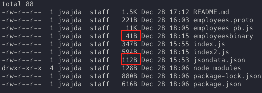

# Protocol Buffers Example

## What are protocol buffers?
Protocol buffers are Google's language-neutral, platform-neutral, extensible mechanism for serializing structured data – think XML, but smaller, faster, and simpler. You define how you want your data to be structured once, then you can use special generated source code to easily write and read your structured data to and from a variety of data streams and using a variety of languages.

- A example use of Protobufs for learning purposes vs using standard JSON.
- Based on the [video here](https://www.youtube.com/watch?v=46O73On0gyI&ab_channel=HusseinNasser)
and this [repo here](https://github.com/hnasr/javascript_playground/blob/master/protobuff/index.js)
- [Protocol Buffers Docs](https://developers.google.com/protocol-buffers)
- [Protocol Buffer Releases](https://github.com/protocolbuffers/protobuf/releases)
- Troubleshooting error when running: the protoc command `--js_out=import_style=commonjs,binary:. employees.proto`

- `protoc-gen-js: program not found or is not executable`  see [Github issue](https://github.com/protocolbuffers/protobuf-javascript/issues/127#issuecomment-1204202844)

## Benefits of ProtoBuff
- Schema driven
- Binary & a very compact size
- Language neutral

## Cons
- Have to have structured data (barrier to entry)
- More involved processes for small applications.
- Can be overkill for getting started quickly.
- Have to make sure to update compiled boilerplate code (bugs, security vulnerability, etc.)
- Hard to use with JSON based applications (Javascript/browser)

## JSON vs Binary data

As you can see the data generated from using protobufs is much smaller than JSON.

